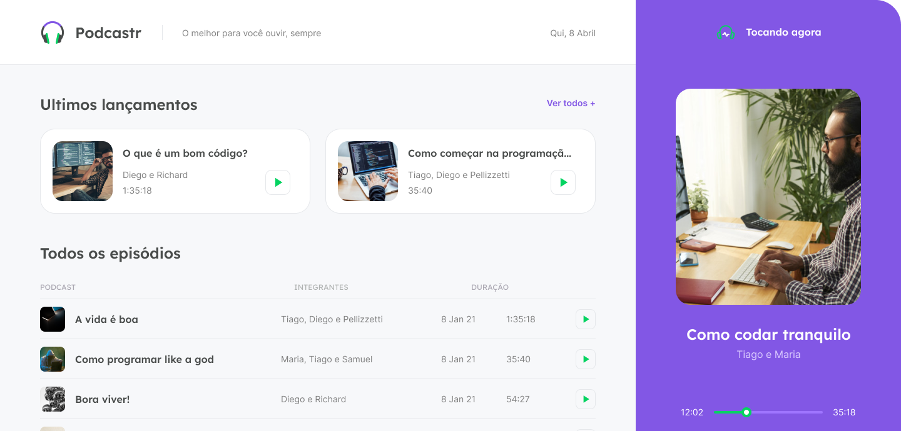

<div align="center">
  
  <h3>podcastr</h3>
  <p>An application to listen to a podcast ✨</p>
  <hr/>
  <p>
    <a href="#-technologies">Technologies</a>&nbsp;&nbsp;&nbsp;|&nbsp;&nbsp;&nbsp;
    <a href="#-about">About</a>&nbsp;&nbsp;&nbsp;|&nbsp;&nbsp;&nbsp;
    <a href="#-how-to-run">How to run</a>
  </p>
</div>

## ✨ Technologies

This project was developed with the following technologies:

- [TypeScript](https://www.typescriptlang.org/)
- [Next.js](https://nextjs.org/)
- [ReactJS](https://reactjs.org/)

## ❓ About
Do you want to listen to our podcast? This is the place!



## 🚀 How to run

```
# Clone this repository
$ https://github.com/brunnosena/podcastr.git

# Install dependencies
$ yarn install our npm install

# Start the project
$ yarn dev or npm run dev
```

The application can be accessed at [`localhost:3000`](http://localhost:3000).

<hr/>

<div align="center">
  <h1>Open Source</h1>
  <sub>Copyright © 2021-present, brunnosena.</sub>
  <p>podcastr <a href="https://github.com/brunnosena/podcastr/tree/dev/LICENSE">is MIT licensed 💖</a></p>
  
</div>